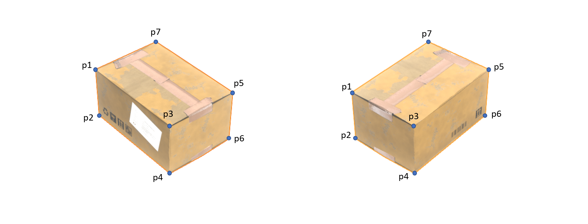

# Cuboid_hidden_corner_detection
<!-- TABLE OF CONTENTS -->
<details open="open">
  <summary><h2 style="display: inline-block">Table of Contents</h2></summary>
  <ol>
    <li>
      <a href="#about-the-project">About The Project</a>
      <ul>
        <li><a href="#Required-libraries">Required Libraries</a></li>
      </ul>
    </li>
     <li>
      <a href="#Usage">Usage</a>
    </li>
    <li>
      <a href="#annotation-rules">Annotation Rules</a>
    </li>

  </ol>
</details>


<!-- ABOUT THE PROJECT -->
## About The Project
The project is aimed to compute the position of the hidden corner of a cuboid in an image. The program takes the following as inputs:
* Image of the Cuboid
* Coordinates (x,y) of the 7 visble corners of the cuboid

The program will give the following outputs:

* Position of the hidden edges and hidden corner
* Uncertainity assosiated with the computed hidden corner

<!-- REQUIRED LIBRARIES -->
### Required Libraries

* OpenCV
* Numpy

## Usage 
The program takes path of an image as an input argument. The visible corners can then manually be selected using the mouses-coursor. `main.py` file envokes the program and path of the image is given after `-i`. A folder is included that contains some test images. 
_For Example_
```sh
python main.py -i pictures/pics2/box2.png
   ```
After the image has been loaded, an annotation window appears. The window allows you to annotate the visible corners of the displayed cuboid using `double-click` of the mouse-coursor. "Annotation rules" must be considered when annotating the Seven Visible corners.

## Annotation Rules
In the cuboid the total of 7 visible corners are needed to be annoted. The corners must be selected from `p1 to p7` in the order, that is specified in the image below. i.e. end points of the verticle edges will be annoted first, starting from the extreme left-side edge. And the top seventh corner is annotated at the end.  

